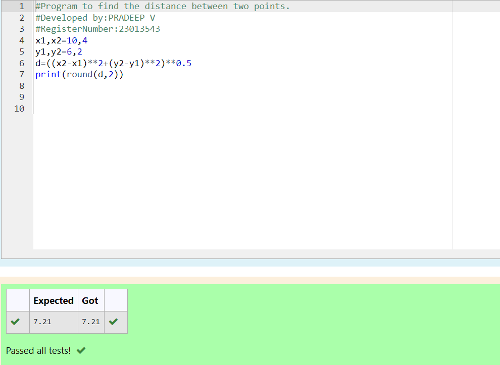

# DISTANCE-BETWEEN-TWO-POINTS

## AIM:
To write a python program to find the distance two 2 points
## ALGORITHM:
### Step 1:
import the math function

### Step 2:
define the coordinates of the two points.

### Step 3: 
Substitute the values in the distance formula  
### Step 4:
Calculate the Euclidean distance using the distance formula 
### Step 5:
Print the result with two decimal places 
### PROGRAM:
```
#Program to find the distance between two points.
#Developed by:PRADEEP V
#RegisterNumber:23013543
x1,x2=10,4
y1,y2=6,2
d=((x2-x1)**2+(y2-y1)**2)**0.5
print(round(d,2))
```


  


### OUTPUT:



### RESULT:
thus output got successfully.
